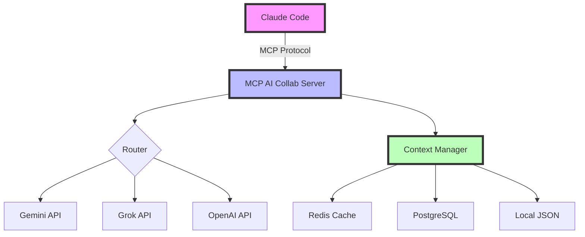

# MCP AI Collab - Give AI Assistants Persistent Memory 🧠

**Transform stateless AI assistants into intelligent collaborators with persistent, project-aware memory.**

[](https://opensource.org/licenses/MIT)
[](https://www.python.org/downloads/)
[](https://github.com/anthropics/mcp)

## 🎯 The Problem We Solve

When you use AI assistants like Gemini, Grok, or ChatGPT through Claude Code, they forget everything between calls:

```
You: "Hey Gemini, help me debug this auth function"
Gemini: "I found the issue on line 42..."

// 5 minutes later...
You: "Gemini, what was that issue we found?"
Gemini: "I don't have any previous context..."  😔
```

**This MCP server fixes that!** Each AI now remembers your conversations per project:

```
You: "Gemini, what was that issue we found?"
Gemini: "We found a race condition in the auth function on line 42. 
         We discussed using a mutex lock to fix it." 🎯
```

## 🌟 Key Features

- **🧠 Persistent Memory** - Each AI maintains conversation history per project
- **📁 Project Isolation** - Separate contexts for different projects automatically
- **🚀 Three Versions** - Choose based on your needs (see below)
- **🔒 100% Secure** - Your API keys never leave your machine
- **⚡ Fast Performance** - Redis caching with PostgreSQL persistence
- **🔧 Easy Setup** - One-click installation with interactive menu

## 📋 Choose Your Version

We offer three versions to match your needs:

| Version | Storage | Setup Time | Best For |
|---------|---------|------------|----------|
| **Clean** (Recommended) | Local JSON files | 1 minute | Individual developers, quick start |
| **Full** | Redis + PostgreSQL | 5 minutes | Teams, production, high performance |
| **Standalone** | Local JSON files | 1 minute | Learning MCP, minimal dependencies |

See [detailed comparison](docs/VERSION_COMPARISON.md) →

## 🚀 Quick Start

```bash
# Clone the repository
git clone https://github.com/RaiAnsar/claude_code-coding-mcp.git
cd claude_code-coding-mcp

# Run interactive setup (recommended)
./one_click_setup.sh
```

The setup wizard will:
1. Check your system requirements
2. Let you choose a version
3. Guide you through API key configuration
4. Install everything automatically

## 🔑 Configuration

### Getting API Keys (Required)

You'll need at least one API key:

- **Gemini**: [Google AI Studio](https://makersuite.google.com/app/apikey) (Free tier available)
- **Grok**: [X.AI Console](https://console.x.ai/) (Requires X Premium+)
- **ChatGPT**: [OpenAI Platform](https://platform.openai.com/api-keys) (Pay as you go)

### Setting API Keys

During setup, you'll be prompted to enter your keys. They're stored in a local `.env` file:

```env
GEMINI_API_KEY=your-gemini-key-here
GROK_API_KEY=your-grok-key-here
OPENAI_API_KEY=your-openai-key-here
```

### Customizing AI Models

You can customize which models to use for each AI service in your `.env` file:

```bash
# Default models (latest versions)
GEMINI_MODEL=gemini-2.5-pro-preview-06-05
GROK_MODEL=grok-3
OPENAI_MODEL=gpt-4o

# You can change to other available models:
# GEMINI_MODEL=gemini-2.0-flash-001
# OPENAI_MODEL=gpt-4o
# GROK_MODEL=grok-2
```

Simply edit your `.env` file to use different models based on your needs (cost, performance, capabilities).

## 📖 How to Use

After installation and restarting Claude Code:

### Basic Commands

```bash
# Check if everything is working
Use db_status

# Ask AIs questions (they'll remember context)
Use ask_gemini to explain this authentication flow
Use ask_grok to help optimize this algorithm
Use ask_openai to review our API design

# Check conversation history
Use show_context with ai "gemini"

# Clear memory for fresh start
Use clear_context with ai "all"
```

### Real Example Session

```
You: Use ask_gemini to analyze the performance bottleneck in our API

Gemini: I can see the main bottleneck is in the database query on line 234...

You: Use ask_gemini to suggest optimization strategies

Gemini: Based on our previous analysis of the bottleneck on line 234, 
        here are three optimization strategies...
        [Gemini remembers the context!]
```

## 🏗️ Architecture



## 🔒 Security & Privacy

**Your API keys are 100% safe:**

- ✅ **Local Storage Only** - Keys are stored in `.env` file on your machine
- ✅ **Never Transmitted** - Except to official AI APIs (Google, X.AI, OpenAI)
- ✅ **Never Logged** - No keys in logs, console output, or error messages
- ✅ **Gitignored** - `.env` files are excluded from version control
- ✅ **Open Source** - Review our code anytime

[Read our Security Policy](SECURITY.md) →

## 📚 Documentation

- [Quick Start Guide](docs/QUICKSTART.md) - Get running in 5 minutes
- [Architecture Overview](docs/ARCHITECTURE.md) - Technical deep dive
- [Version Comparison](docs/VERSION_COMPARISON.md) - Choose the right version
- [Troubleshooting](docs/TROUBLESHOOTING.md) - Common issues and solutions
- [Examples](docs/EXAMPLES.md) - Real-world usage patterns

## ❓ FAQ

**Q: Is this trying to steal my API keys?**  
A: No! Your keys stay on your machine. Check our source code - we're fully open source.

**Q: Which version should I use?**  
A: Start with the Clean version. You can always upgrade to Full later.

**Q: Can I use just one AI?**  
A: Yes! You only need API keys for the AIs you want to use.

**Q: Does this work with Claude's /clear command?**  
A: Yes! When you clear Claude's context, it clears the AI contexts too.

**Q: How is this different from using AIs directly?**  
A: This gives them memory within Claude Code, making them true collaborators.

## 🤝 Contributing

We welcome contributions! See [CONTRIBUTING.md](CONTRIBUTING.md) for guidelines.

## 📜 License

MIT License - see [LICENSE](LICENSE) for details.

## 🙏 Acknowledgments

Built on top of the [MCP protocol](https://github.com/anthropics/mcp) by Anthropic.

---

**Ready to give your AI assistants persistent memory?** [Get started now!](#-quick-start) 🚀